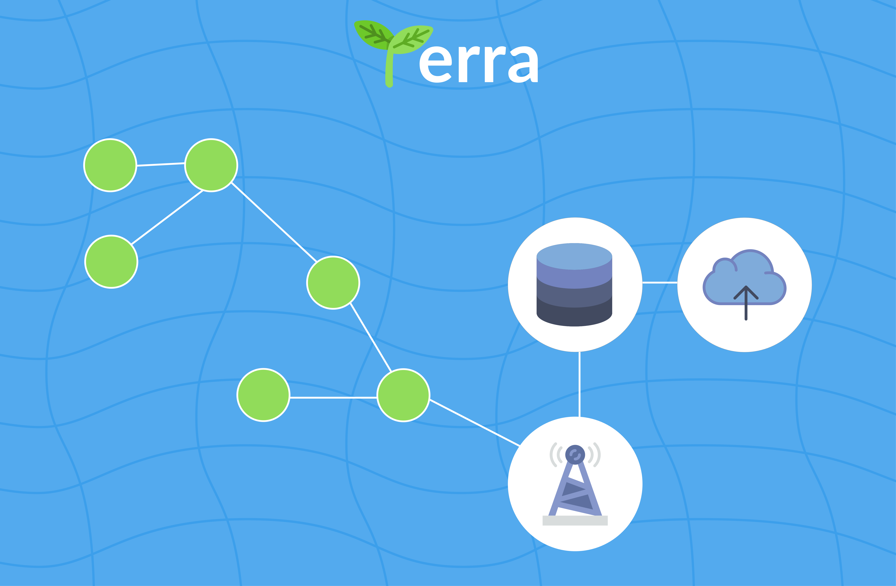

## Video Demo: https://drive.google.com/file/d/0B7u4AK42WIUuMUJmNU5STGd5V1E/view?usp=sharing

## The Problem
Nowadays everyone is using data to make better smarter decisions. But in many cases, data must be collected across large areas of land that have little to no wired/wireless infrastructure. We looked specifically at farming and came up with a peer to peer sensor communication system which can run **without** wide ranging Wi-Fi or cellular data.

## Our Inspiration
We noticed that any sensory network can be modeled as a mathematical graph with nodes being sensor and edges showing what nodes can connect wirelessly. Of course, some sensors are a significant distance away, but as long as the graph is a fully connected graph. We theorized data can be sent along this mesh until it is delivered to a HOME node which can upload the data to a server.

##How We Built Terra
All of our sensors were NXP i.MX7 dev boards which we flashed **Android Things** onto. Using **Android Nearby** we were able to communicate to relatively near sensors and pass data. Using those two as our basis we implement a modified **Depth Frist Traversal** (DFT) originating from the home node so that as the traversal propagated back we would send the data with it.

We triggered this DFT using an **iOS app** on an iPad with **Firebase** which communicated to the HOME node/sensor. The HOME node/sensor would then send the data to our **Django** server which stores it using **SQLite**. We then pull the data to our app for the user(Farm) to see what the readings of the

## Challenges we ran into
_ So so **SO** _ many challenges. Implementing our DFT was the most technically challenging because it was an implementation of an algorithm we had just created and in order to implement it, we had to use technologies that we just learned with limited documentation/stackoverflow help.

## Accomplishments that we're proud of
We were able to use Android nearby and Android things successfully to enable our traversal algorithm. These are two relatively new technologies which hadn't been used in this context before.

## What's next for Terra
There are **SO** many more applications for a communication system like this. Whether it is city wide pollution monitoring or traffic analysis, the demand for gathering data is increasing daily and with it, the need for a system like Terra also increases. We are going to host our code on GitHub and would love for people to help us improve and iterate on this cool new tech.
